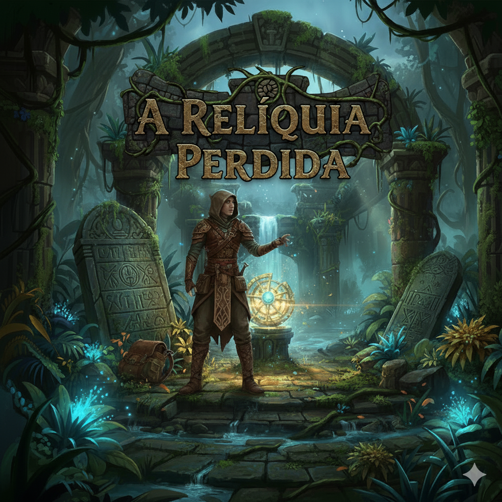

# A Relíquia Perdida

## Objetivo

A Relíquia Perdida é um jogo de exploração em que o jogador assume o papel de um explorador em ruínas antigas, com o objetivo de encontrar uma relíquia perdida. A experiência é estruturada em níveis, cada um com inimigos, armadilhas e itens dispostos de forma aleatória, incentivando a exploração constante do mapa. O jogador deve localizar saídas escondidas para progredir, enfrentando múmias, dançarinas hipnóticas e obstáculos como areia movediça ou pisos falsos. Durante a jornada, itens como poções de cura, bússolas e tochas auxiliarão na sobrevivência e descoberta de segredos. 

### Tipo de Jogo
Um jogo de aventura e exploração inspirado em ToeJam & Earl, porém ambientado em um universo de arqueologia no estilo Indiana Jones.

### Diferencial
Em discussão, porém usaremos elementos de roguelike, incluindo geração procedural de mapas, para adicionar alguma complexidade nas mecânicas do jogo.

## Mecânica
*Em discussão.*

## Pontuação
*Em discussão.*

Detalhes serão adicionados ou modificados no decorrer do desenvolvimento do jogo conforme o grupo for verificando a viabilidade da implementação das mecânicas idealizadas.
