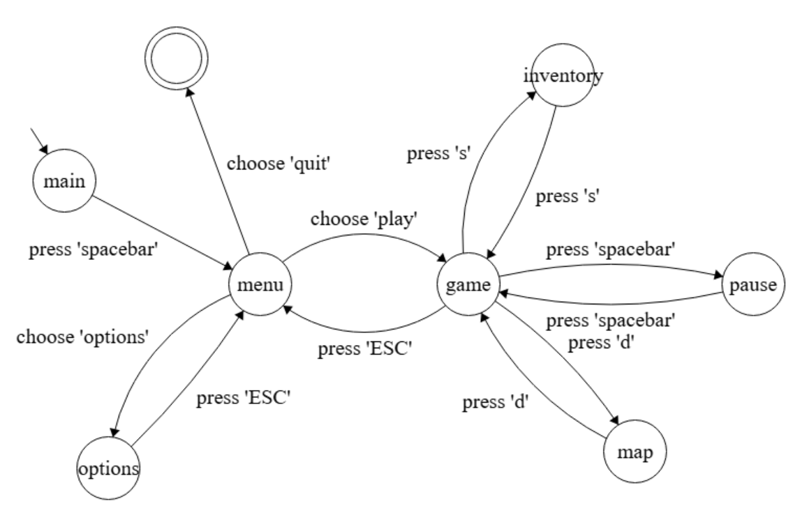

Implementação ingênua de um protótipo de interface, estruturado a partir da FSM acima para gerenciar as diferentes telas e interações do jogador.

# Estados do jogo:

* `Tela Inicial:` exibe logo e botão "Start" com efeito de "destaque";
* `Menu Principal:` opções para jogar, configurações (placeholder) e sair;
* `Play:` simulação qualquer do jogo com um retângulo azul que pode ser controlado com as setas do teclado;
* `Pause:` janela sobreposta acessada pela tecla de Espaço;
* `Inventário:` aberto/fechado pela tecla S;
* `Mapa:` visualização do mapa que poderá ser acessada pela tecla D;
* `Quit:` encerra o jogo;

# Controles Básicos

### `Tela inicial:`
- **Espaço:** acessar menu

### `Menu:`

- **↑ / ↓:** navegar entre botões
- **a:** confirmar

### `Play:` (simulação)
- **← / → / ↑ / ↓:** mover retângulo
- **S:** abrir/fechar inventário (*efeito adicional:* pausa o jogo)
- **D:** abrir/fechar mapa (*efeito adicional:* pausa o jogo)
- **Espaço:** pausar jogo
- **Esc:** voltar ao menu

# Comentários adicionais:
- **Prioridade:** organizar o código;
- **Prioridade:** desenvolver jogo (Estado Play);
- **Prioridade:** implementar tela de inventário (Estado Inventory);
- **Importante:** implementar tela de mapa (Estado Map);
- **Útil:** implementar tela de opções (Estado Options);
- As imagens do protótipo foram geradas com uso de IA. Dessa forma, é provável que a identidade visual do jogo mude.

